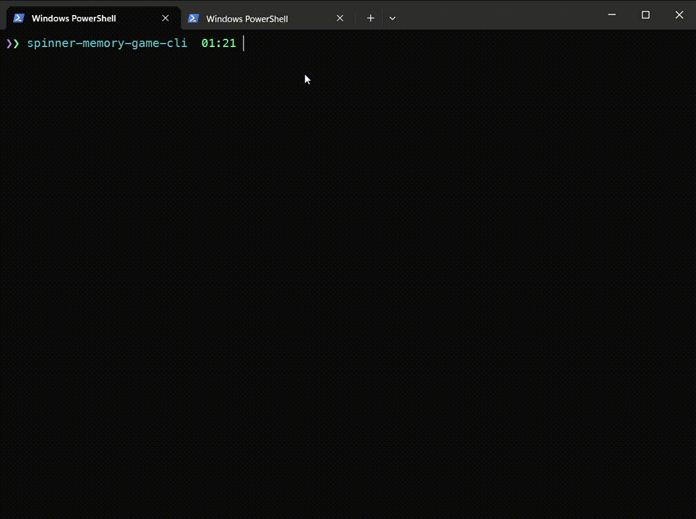

# spinner-memory-game-cli [![NPM version][npm-image]][npm-url]

> CLI game - Remember spinners appearences sequence and restore the correspondence of spinners to their appearance numbers.

## Install

```bash
$ npm install --global spinner-memory-game-cli
```

## CLI

```
  Usage
    $ spinner-memory-game-cli

  Shorthand command aliases:
    $ spinner-game
    $ spigame
    $ spiga

  Options
    --filler          Symbol to be used as a placeholder in a game table.
    --run             Whether to run a game immediately without game description (default is true).
    --funny           Use funnier spinners.


  Examples
    $ spinner-memory-game-cli
    $ spinner-memory-game-cli --no-run
    $ spinner-memory-game-cli --funny
    $ spinner-memory-game-cli --filler "*"
```

## Demos



### Using funnier spinners

```bash
  $ spinner-memory-game-cli --funny
```


## License

MIT © [Rushan Alyautdinov](https://github.com/akgondber)

[npm-image]: https://img.shields.io/npm/v/spinner-memory-game-cli.svg?style=flat
[npm-url]: https://npmjs.org/package/spinner-memory-game-cli
